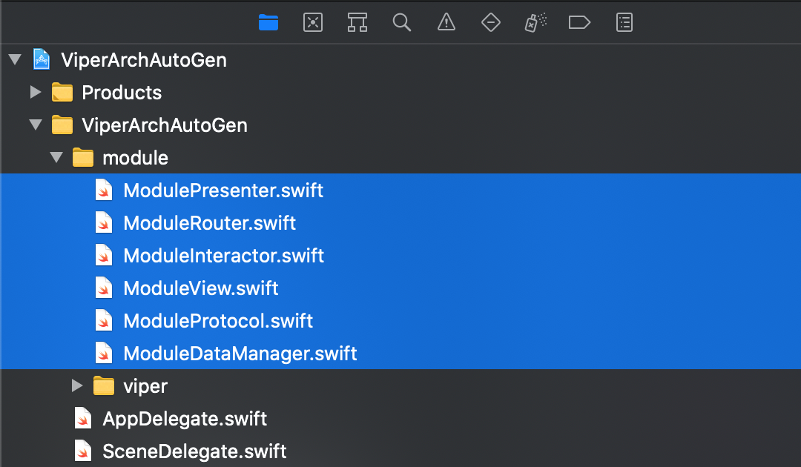

# iOS_SwiftViperAutoGen
The template support auto generates all files that you need to create a new module follow VIPER architecture.

# VIPER 
I believe that when you're reaching this repo, you're cleared what is VIPER and why is VIPER.
<br>
[]()

# Install
```shell
$sudo ./install.sh
```
Or manually, you can to go to `/Applications/Xcode.app/Contents/Developer/Library/Xcode/Templates/File Templates/Source/` folder and copy `Swift VIPER Files.xctemplate` folder into there.
>Tip: Using `Go/Go to Folder...` on Finder menu bar.


# Usage
## Overview
[]()
<br>
## Create
Create new file and choice `Swift VIPER Files` 
<br>
[]()
<br>
## Result
On my example, I'm used module name is `Module`.<br>
<br>
[]()
<br>
Overview files structure<br>
[]()
<br>
Let see function build module to use<br>
[]()


# References
[The Clean Architecture - Uncle Bob](https://blog.cleancoder.com/uncle-bob/2012/08/13/the-clean-architecture.html)<br>
[Architecting iOS Apps with VIPER](https://www.objc.io/issues/13-architecture/viper/)<br>
[A step-by-step guide to create a custom Xcode template](https://diamantidis.github.io/2019/07/21/xcode-custom-templates)


# Example
Open an [Arch_VIPER_MVVM](https://github.com/lamhoangx/Arch_VIPER_MVVM.git)

#
Happy coding!